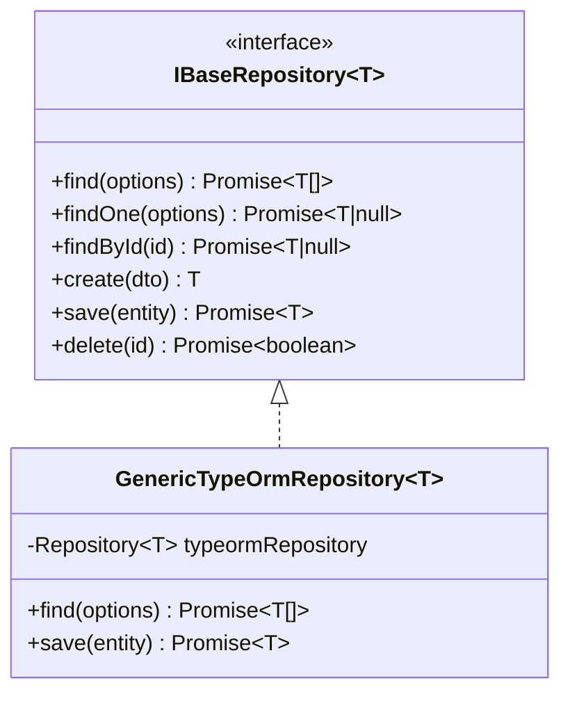
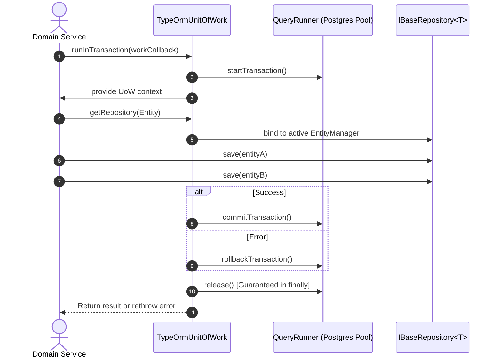
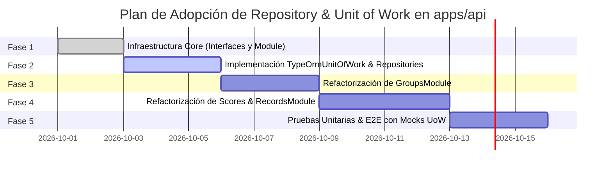

# Specification: Repository Pattern & Unit of Work (UoW) Standard for `apps/api`

## Status
- **Status**: Proposed / Approved Specification
- **Target Component**: `apps/api` (NestJS / TypeORM / PostgreSQL)
- **Author**: Backend Architecture Team

---

## 1. Executive Summary & State of the Art

### 1.1 Context
In the current NestJS backend architecture (`apps/api`), database operations interact directly with TypeORM repositories injected via `@InjectRepository(Entity)`. When operations require atomic execution across multiple entities (for example, creating a `Group` alongside its initial director `GroupMember`, or registering a `RehearsalRecord` while emitting derived `Notification` entities), transaction management is either missing or manually orchestrated via TypeORM `QueryRunner` inside service methods.

Manual transaction management in services leads to several architectural problems:
1. **Leaky Abstractions**: Business logic in domain services becomes tightly coupled to low-level TypeORM transaction APIs (`DataSource.createQueryRunner()`, `startTransaction()`, `commitTransaction()`, `rollbackTransaction()`).
2. **Resource Leakage Risks**: Forgetting a `queryRunner.release()` call in a error handling path causes orphaned connection leaks in the PostgreSQL connection pool.
3. **Testing Friction**: Unit testing service methods that orchestrate transactions via `QueryRunner` requires heavy mocking of internal TypeORM connection methods.

---

### 1.2 Evaluation of Existing Patterns & Libraries

#### Option A: External Library (`typeorm-transactional` via `AsyncLocalStorage`)
* **Mechanism**: Intercepts method execution using TypeScript decorators (`@Transactional()`) and maintains transaction state in Node.js `AsyncLocalStorage`.
* **Pros**: Declarative syntax with low boilerplate in service methods.
* **Cons**: Requires monkey-patching TypeORM's `Repository` prototype during bootstrap; can hide implicit transaction boundaries; complicates unit testing and custom isolation levels.

#### Option B: Lightweight Custom Abstraction (`IBaseRepository<T>` + `IUnitOfWork`) [RECOMMENDED]
* **Mechanism**: Introduce clean TypeScript interfaces (`IBaseRepository<T>`, `IUnitOfWork`) and a concrete `TypeOrmUnitOfWork` implementation leveraging `QueryRunner` wrapped in safe `try/catch/finally` blocks.
* **Pros**: Zero external magic/monkey-patching; 100% type-safe; fully testable via mock implementations; explicit transaction boundary scoping; guaranteed connection release.
* **Decision**: Adopt **Option B** as the architectural standard for `apps/api`.

---

## 2. Architecture & Design Specification

### 2.1 Repository Pattern Abstraction (`IBaseRepository<T>`)

The repository pattern abstracts data persistence operations behind a domain-oriented contract.



#### Contract Definition (`apps/api/src/common/database/interfaces/base-repository.interface.ts`)
```typescript
import { FindManyOptions, FindOneOptions, DeepPartial } from 'typeorm';

export interface IBaseRepository<T> {
  find(options?: FindManyOptions<T>): Promise<T[]>;
  findOne(options: FindOneOptions<T>): Promise<T | null>;
  findById(id: string): Promise<T | null>;
  create(entityLike: DeepPartial<T>): T;
  save(entity: T): Promise<T>;
  saveMany(entities: T[]): Promise<T[]>;
  delete(id: string): Promise<boolean>;
}
```

---

### 2.2 Unit of Work Pattern Specification (`IUnitOfWork`)

The Unit of Work pattern maintains a list of business transactions and coordinates the writing out of changes and the resolution of concurrency problems.



#### Contract Definition (`apps/api/src/common/database/interfaces/unit-of-work.interface.ts`)
```typescript
import { EntityManager } from 'typeorm';
import { EntityTarget } from 'typeorm/common/EntityTarget';
import { IBaseRepository } from './base-repository.interface';

export type IsolationLevel = 'READ UNCOMMITTED' | 'READ COMMITTED' | 'REPEATABLE READ' | 'SERIALIZABLE';

export interface IUnitOfWork {
  runInTransaction<R>(
    work: (uow: IUnitOfWork) => Promise<R>,
    isolationLevel?: IsolationLevel,
  ): Promise<R>;

  getRepository<T>(entityClass: EntityTarget<T>): IBaseRepository<T>;
  getEntityManager(): EntityManager;
}
```

---

### 2.3 Concrete Implementation (`TypeOrmUnitOfWork`)

```typescript
import { Injectable, Scope } from '@nestjs/common';
import { DataSource, EntityManager, QueryRunner } from 'typeorm';
import { EntityTarget } from 'typeorm/common/EntityTarget';
import { IUnitOfWork, IsolationLevel } from './interfaces/unit-of-work.interface';
import { IBaseRepository } from './interfaces/base-repository.interface';
import { GenericTypeOrmRepository } from './generic-typeorm.repository';

@Injectable()
export class TypeOrmUnitOfWork implements IUnitOfWork {
  private activeEntityManager?: EntityManager;

  constructor(private readonly dataSource: DataSource) {}

  async runInTransaction<R>(
    work: (uow: IUnitOfWork) => Promise<R>,
    isolationLevel: IsolationLevel = 'READ COMMITTED',
  ): Promise<R> {
    const queryRunner: QueryRunner = this.dataSource.createQueryRunner();

    await queryRunner.connect();
    await queryRunner.startTransaction(isolationLevel);

    const scopedUow = new TypeOrmUnitOfWork(this.dataSource);
    scopedUow.activeEntityManager = queryRunner.manager;

    try {
      const result = await work(scopedUow);
      await queryRunner.commitTransaction();
      return result;
    } catch (error) {
      await queryRunner.rollbackTransaction();
      throw error;
    } finally {
      await queryRunner.release();
    }
  }

  getRepository<T>(entityClass: EntityTarget<T>): IBaseRepository<T> {
    const manager = this.activeEntityManager || this.dataSource.manager;
    return new GenericTypeOrmRepository<T>(manager.getRepository(entityClass));
  }

  getEntityManager(): EntityManager {
    return this.activeEntityManager || this.dataSource.manager;
  }
}
```

---

## 3. High-Priority Domain Use Cases

### 3.1 Case 1: Group Creation with Initial Director Membership (`GroupsService.createGroup`)
When a user creates a music group, the `Group` entity and the initial `GroupMember` (with role `'director'`) must be persisted atomically.

```typescript
async createGroup(dto: CreateGroupDto, ownerId: string): Promise<Group> {
  return this.unitOfWork.runInTransaction(async (uow) => {
    const groupRepo = uow.getRepository(Group);
    const memberRepo = uow.getRepository(GroupMember);

    const group = groupRepo.create({
      name: dto.name,
      description: dto.description,
      type: dto.type,
      join_code: generateCode(),
      owner: { id: ownerId },
    });

    const savedGroup = await groupRepo.save(group);

    const initialMember = memberRepo.create({
      group: { id: savedGroup.id },
      user: { id: ownerId },
      role: 'director',
      status: 'active',
    });

    await memberRepo.save(initialMember);
    return savedGroup;
  });
}
```

### 3.2 Case 2: Public Score Import & Notification Emission (`ScoresService.importPublicScore`)
Importing a score creates the `Score` entity and emits a notification to group members.

```typescript
async importPublicScore(dto: ImportScoreDto, groupId: string, userId: string): Promise<Score> {
  return this.unitOfWork.runInTransaction(async (uow) => {
    const scoreRepo = uow.getRepository(Score);
    const notifRepo = uow.getRepository(Notification);

    const score = scoreRepo.create({
      title: dto.title,
      composer: dto.composer,
      pdf_url: dto.pdfUrl,
    });
    const savedScore = await scoreRepo.save(score);

    const notification = notifRepo.create({
      type: 'sheet_uploaded',
      title: `Nueva partitura: ${savedScore.title}`,
      user: { id: userId },
    });
    await notifRepo.save(notification);

    return savedScore;
  });
}
```

---

## 4. Resilience & Testing Strategy

### 4.1 Unit Testing Strategy with `MockUnitOfWork`
Service unit tests do not require real database connections or TypeORM instances.

```typescript
export class MockUnitOfWork implements IUnitOfWork {
  private repositories = new Map<any, any>();

  setRepository<T>(entity: any, mockRepo: Partial<IBaseRepository<T>>) {
    this.repositories.set(entity, mockRepo);
  }

  async runInTransaction<R>(work: (uow: IUnitOfWork) => Promise<R>): Promise<R> {
    return work(this);
  }

  getRepository<T>(entityClass: EntityTarget<T>): IBaseRepository<T> {
    return this.repositories.get(entityClass);
  }

  getEntityManager(): any {
    return {};
  }
}
```

### 4.2 Pool Exhaustion & Connection Leak Prevention
1. **Guaranteed Cleanup**: The `finally` block in `TypeOrmUnitOfWork.runInTransaction` ensures `queryRunner.release()` is executed regardless of whether the transaction commits or throws an unhandled exception.
2. **Timeout Enforcement**: Transactions carry a maximum execution threshold (e.g. 5000ms) to prevent long-running table locks in PostgreSQL.

---

## 5. Adoption & Phase Rollout Plan



1. **Phase 1: Core Module (`apps/api/src/common/database/`)**
   - Create interfaces (`IBaseRepository`, `IUnitOfWork`).
   - Register `DatabaseModule` as global module in NestJS.
2. **Phase 2: Unit of Work Implementation**
   - Provide `TypeOrmUnitOfWork` via NestJS Dependency Injection token `UNIT_OF_WORK`.
3. **Phase 3: Module-by-Module Migration**
   - Migrate `GroupsModule` (`GroupsService`).
   - Migrate `ScoresModule` and `RecordsModule`.
   - Maintain backwards compatibility with existing direct repository injections during transition.
4. **Phase 4: Automated Verification**
   - Add unit tests validating transaction rollback behavior upon error injection.
