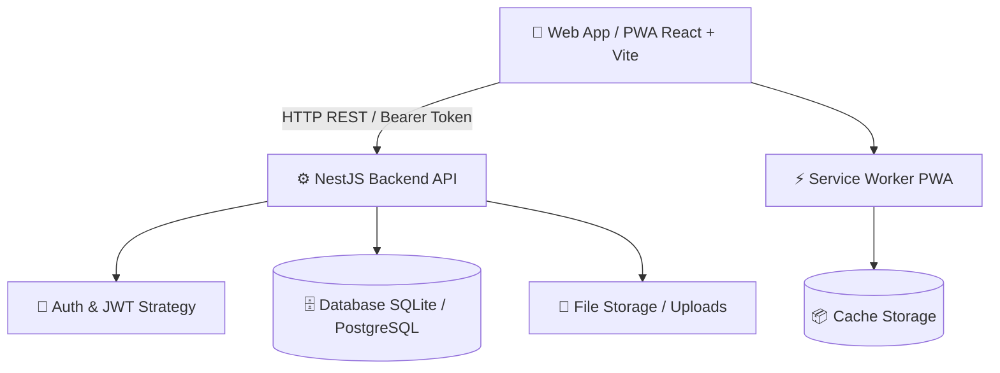

# 🎵 Wiki oficial de Music Folder

Bienvenido a la Wiki de **Music Folder**, la plataforma integral para la gestión de agrupaciones musicales, orquestas, coros y conjuntos de cámara.

---

## 📌 Índice de la Wiki

| Página | Descripción |
| :--- | :--- |
| 📖 [Home](Home) | Página principal e índice general de la documentación. |
| 🏗️ [Arquitectura y Tecnologías](Arquitectura-y-Tecnologias) | Estructura del monorepo, backend NestJS, frontend React, base de datos y modelo de dominio. |
| 🚀 [Guía de Instalación y Desarrollo](Guia-de-Instalacion) | Requisitos, configuración de entorno, ejecución local (`npm run dev`) y compilación de producción. |
| 🔐 [Autenticación y Roles](Autenticacion-y-Roles) | Flujo JWT, gestión de sesiones, roles del sistema (`Director`, `Músico`, `Jefe de Cuerda`) y permisos. |
| 📡 [Módulos y Endpoints REST](Modulos-y-Endpoints) | Documentación de la API: Auth, Partituras, Grupos, Ensayos, Comunidad, Biblioteca y Notificaciones. |
| 📲 [PWA y Soporte Offline](PWA-y-Soporte-Offline) | Instalación en dispositivos móviles/escritorio, Service Worker, actualización en tiempo real y caché local. |

---

## 🎼 Resumen del Proyecto

**Music Folder** permite a directores, músicos y administradores de agrupaciones musicales:
- **Organizar repertorio y partituras**: Almacenar y categorizar partituras en PDF por instrumento, dificultad y conjunto.
- **Gestionar agrupaciones y miembros**: Crear grupos musicales, códigos de invitación únicos y roles de integrantes.
- **Programar ensayos**: Agendar fechas, horarios, sedes, obras a ensayar y registro de asistencia.
- **Fomentar la comunidad**: Foros de discusión por grupo, avisos y anuncios oficiales.
- **Notificaciones en tiempo real**: Alertas de partituras subidas, ensayos programados y novedades.
- **Experiencia Móvil PWA**: Funciona como App instalable en Android, iOS y Escritorio con soporte offline.

---

## 🏛️ Visión General de la Arquitectura

